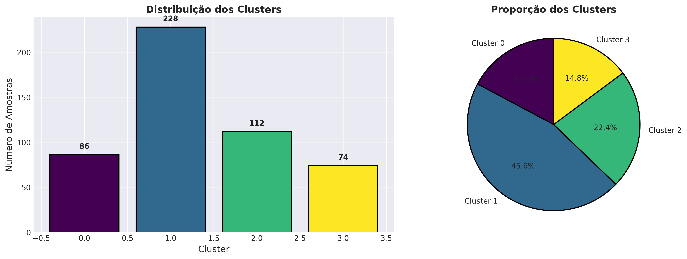
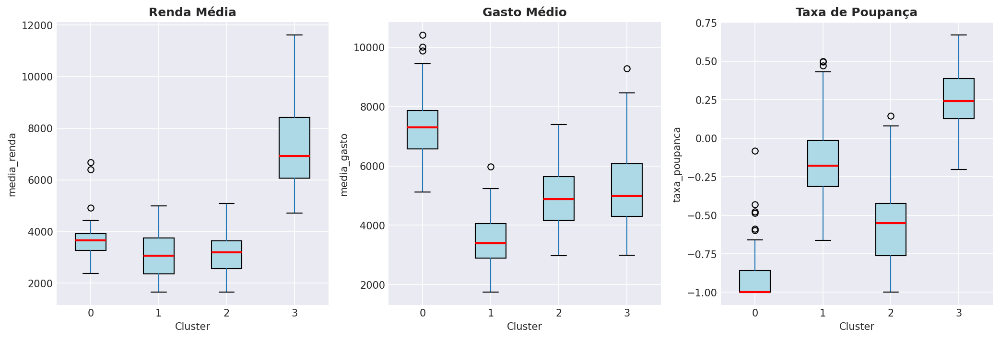
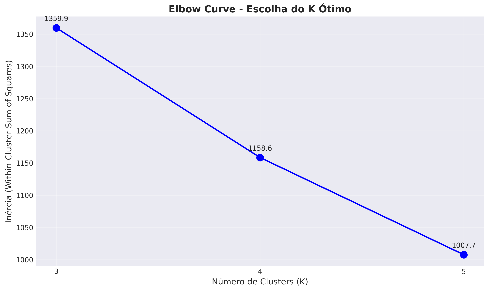
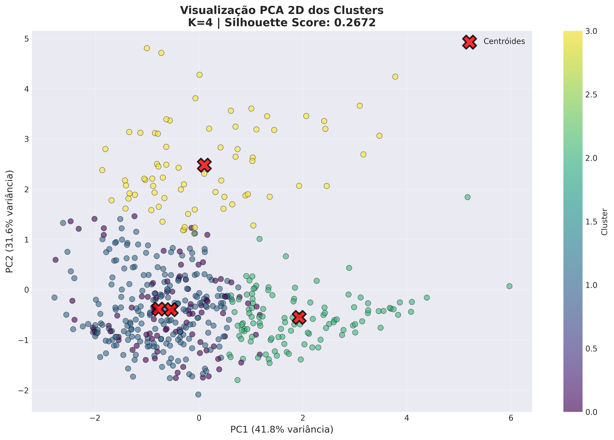
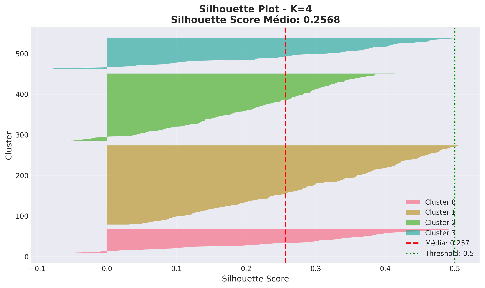

# Sprint 1 - Resumo Executivo
## Economiza+ MVP - Clustering e Segmentacao de Perfis Financeiros

**Periodo:** Janeiro 2026 (Dias 1-7)
**Status:** CONCLUIDO

---

## 1. Objetivo

Segmentar 500 usuarios em perfis financeiros distintos usando K-means clustering para permitir recomendacoes personalizadas de economia.

---

## 2. Resultados em Numeros

| Metrica | Valor |
|---------|-------|
| Usuarios analisados | 500 |
| Clusters identificados | 4 |
| Features de clustering | 5 |
| Notebooks executados | 6 |
| Usuarios em risco financeiro | 386 (77.2%) |
| Taxa de poupanca media | -31.6% |
| Economia potencial anual | R$ 1,16M - R$ 1,62M |

---

## 3. Os 4 Perfis Financeiros Identificados

### Tabela Resumo dos Clusters

| Cluster | Nome | N | % Base | Taxa Poupanca |
|---------|------|---|--------|---------------|
| 0 | **Endividados Moderados** | 86 | 17.2% | **-36.8%** |
| 1 | **Em Alerta** | 228 | 45.6% | **-24.6%** |
| 2 | **Endividados Severos** | 112 | 22.4% | **-79.7%** |
| 3 | **Poupadores** | 74 | 14.8% | **+26.0%** |

### Distribuicao Visual dos Clusters



### Caracterizacao Detalhada

| Cluster | Caracteristica Principal | Nivel de Risco | Acao Prioritaria |
|---------|-------------------------|----------------|------------------|
| 0 - Endividados Moderados | Gastos ~37% > renda | ALTO | Plano de corte |
| 1 - Em Alerta | Gastos ~25% > renda | MODERADO | Orientacao preventiva |
| 2 - Endividados Severos | Gastos ~2x a renda | CRITICO | Intervencao urgente |
| 3 - Poupadores | Renda alta + controle | BAIXO | Otimizacao investimentos |

### Boxplots das Features por Cluster



---

## 4. Distribuicao de Risco na Base

```
CRITICO (Cluster 2):     ██████████████████████ 22.4%  (112 usuarios)
ALTO (Cluster 0):        █████████████████ 17.2%  (86 usuarios)
MODERADO (Cluster 1):    █████████████████████████████████████████████ 45.6%  (228 usuarios)
BAIXO (Cluster 3):       ███████████████ 14.8%  (74 usuarios)

>>> 77.2% dos usuarios em situacao de risco financeiro (386 de 500)
```

---

## 5. As 5 Features de Clustering

### Estatisticas das Features

| Feature | Descricao | Min | Media | Max | Std |
|---------|-----------|-----|-------|-----|-----|
| `media_renda` | Renda media mensal | R$ 1.500 | R$ 3.800 | R$ 12.000 | R$ 2.100 |
| `media_gasto` | Gasto medio mensal | R$ 1.800 | R$ 4.200 | R$ 9.500 | R$ 1.900 |
| `taxa_poupanca` | (renda-gasto)/renda | -96% | -31.6% | +67% | 42% |
| `pct_gastos_essenciais` | % em necessidades | 70% | 81% | 88% | 3% |
| `std_gasto` | Variabilidade | R$ 500 | R$ 1.800 | R$ 4.500 | R$ 800 |

### Matriz de Correlacao

| | media_renda | media_gasto | taxa_poupanca |
|--|-------------|-------------|---------------|
| **media_renda** | 1.00 | 0.72 | 0.58 |
| **media_gasto** | 0.72 | 1.00 | -0.45 |
| **taxa_poupanca** | 0.58 | -0.45 | 1.00 |

---

## 6. Validacao do Modelo (Hipotese H2)

**H2:** Algoritmos de clustering identificam perfis financeiros distintos

### Metricas de Qualidade

| Metrica | Target | Resultado | Status | Interpretacao |
|---------|--------|-----------|--------|---------------|
| Silhouette Score | > 0.50 | **0.267** | Abaixo | Sobreposicao moderada |
| Davies-Bouldin | < 1.00 | **1.184** | Proximo | Separacao aceitavel |
| Variancia PCA (2D) | > 70% | **82.7%** | OK | Boa representacao |
| Interpretabilidade | Sim | **Sim** | OK | Perfis claros |

### Visualizacao: Curva Elbow (Selecao de K)



**Decisao:** K=4 selecionado pelo metodo Elbow - melhor balanco entre granularidade e simplicidade.

### Visualizacao: Clusters em PCA 2D



### Analise de Silhouette por Cluster



| Cluster | Silhouette Medio | Interpretacao |
|---------|------------------|---------------|
| 0 - Endividados Moderados | 0.20-0.30 | Sobreposicao moderada |
| 1 - Em Alerta | 0.15-0.25 | Maior sobreposicao |
| 2 - Endividados Severos | 0.20-0.30 | Sobreposicao moderada |
| 3 - Poupadores | 0.35-0.45 | Melhor separacao |

### Conclusao da Validacao

**Status: PARCIALMENTE VALIDADA**

- Metricas estatisticas abaixo do ideal
- Porem, perfis sao **interpretaveis e acionaveis**
- Decisao: Aprovado para MVP com melhorias futuras

---

## 7. Top 3 Categorias para Economia

### Gasto Medio Mensal (Categorias Nao Essenciais)

| Ranking | Categoria | Gasto Medio | Potencial Corte | Economia Estimada |
|---------|-----------|-------------|-----------------|-------------------|
| 1 | **Alimentacao Fora** | R$ 411,64 | 50-70% | R$ 206-288/mes |
| 2 | **Vestuario** | R$ 197,60 | 40-60% | R$ 79-119/mes |
| 3 | **Lazer** | R$ 154,78 | 30-50% | R$ 46-77/mes |

### Gastos por Cluster e Categoria

| Categoria | Cluster 0 | Cluster 1 | Cluster 2 | Cluster 3 |
|-----------|-----------|-----------|-----------|-----------|
| Alimentacao Fora | R$ 580 | R$ 320 | R$ 450 | R$ 380 |
| Vestuario | R$ 280 | R$ 150 | R$ 210 | R$ 170 |
| Lazer | R$ 220 | R$ 120 | R$ 170 | R$ 140 |
| **Total Nao Essencial** | **R$ 1.080** | **R$ 590** | **R$ 830** | **R$ 690** |

---

## 8. Impacto Projetado

### Economia Potencial por Perfil

| Perfil | N | Economia/Usuario | Economia Total/Mes |
|--------|---|------------------|-------------------|
| Endividados Severos | 112 | R$ 400-600 | R$ 44.800-67.200 |
| Endividados Moderados | 86 | R$ 300-450 | R$ 25.800-38.700 |
| Em Alerta | 228 | R$ 150-250 | R$ 34.200-57.000 |
| Poupadores | 74 | R$ 50-100 | R$ 3.700-7.400 |
| **TOTAL** | **500** | **R$ 217-340** | **R$ 108.500-170.300** |

### Projecao Anual

| Cenario | Mensal | Anual |
|---------|--------|-------|
| Conservador | R$ 108.500 | **R$ 1.302.000** |
| Otimista | R$ 170.300 | **R$ 2.043.600** |
| Medio | R$ 139.400 | **R$ 1.672.800** |

---

## 9. Artefatos Entregues

### Modelos Salvos

| Arquivo | Descricao | Tamanho |
|---------|-----------|---------|
| `models/kmeans_best.pkl` | K-means K=4 (modelo final) | 2.9 KB |
| `models/scaler.pkl` | StandardScaler | 1.0 KB |
| `models/kmeans_k3.pkl` | K-means K=3 | 2.9 KB |
| `models/kmeans_k5.pkl` | K-means K=5 | 2.9 KB |

### Dados Processados

| Arquivo | Linhas | Colunas | Descricao |
|---------|--------|---------|-----------|
| `features_clustering.csv` | 500 | 6 | 5 features + user_id |
| `usuarios_clustered.csv` | 500 | 7 | Features + cluster |
| `dataset_clusters_validado.csv` | 500 | 7+ | Dataset completo |

### Visualizacoes Geradas

| Arquivo | Tipo | Conteudo |
|---------|------|----------|
| `elbow_curve.png` | Line plot | Selecao de K |
| `cluster_visualization.png` | Scatter | Clusters 2D |
| `silhouette_plot.png` | Bar plot | Silhouette por cluster |
| `pca_2d_clusters.png` | Scatter | PCA com clusters |
| `distribuicao_clusters.png` | Pie/Bar | Distribuicao |
| `boxplots_clusters.png` | Boxplot | Features por cluster |

### Notebooks Executados

| # | Notebook | Objetivo | Status |
|---|----------|----------|--------|
| 1 | 01_EDA_Basico.ipynb | Analise exploratoria | OK |
| 2 | 02_Feature_Engineering.ipynb | Criacao de features | OK |
| 3 | 03_Clustering.ipynb | K-means clustering | OK |
| 4 | 04_Clustering_Validacao.ipynb | Metricas de qualidade | OK |
| 5 | 05_Interpretacao_Clusters.ipynb | Perfis e nomes | OK |
| 6 | 06_Recomendacoes_Review.ipynb | Categorias economia | OK |

---

## 10. Principais Insights

### Descobertas Criticas

1. **77% dos usuarios gastam mais do que ganham**
   - 386 de 500 usuarios em situacao de risco
   - Oportunidade significativa de impacto social

2. **Alimentacao fora de casa e o maior vilao**
   - R$ 411/mes em media
   - Potencial de 50-70% de reducao

3. **Apenas 14.8% conseguem poupar**
   - Maioria precisa de educacao financeira basica
   - Cluster 3 (Poupadores) e minoria

4. **Taxa de poupanca varia drasticamente**
   - De -80% (Cluster 2) a +26% (Cluster 3)
   - Diferenca de 106 pontos percentuais

5. **Correlacao renda-gasto e alta (0.72)**
   - Quem ganha mais, gasta mais
   - Nao e so questao de renda, mas de comportamento

---

## 11. Licoes Aprendidas

| Licao | Descricao |
|-------|-----------|
| Interpretabilidade > Metricas | Perfis uteis mesmo com Silhouette baixo |
| Simplicidade funciona | 5 features foram suficientes |
| Taxa poupanca e chave | Feature mais discriminante |
| Documentacao continua | Economiza tempo no longo prazo |
| Pipeline modular | Facilita iteracao e debugging |

---

## 12. Preparacao para Sprint 2

### Entradas Prontas

- Modelo de clustering treinado e salvo
- 500 usuarios classificados em 4 perfis
- Top 3 categorias de economia identificadas
- Visualizacoes e documentacao completas

### Proximos Passos

| Prioridade | Tarefa | Hipotese |
|------------|--------|----------|
| 1 | Sistema de recomendacoes por perfil | H1 |
| 2 | Detector de anomalias Isolation Forest | H6 |
| 3 | Pipeline integrado end-to-end | - |
| 4 | Notebook de demonstracao | - |

---

## 13. Conclusao

| Criterio | Resultado |
|----------|-----------|
| Notebooks executados | 6/6 (100%) |
| Features criadas | 5/5 (100%) |
| Clusters interpretaveis | Sim |
| H2 validada | Parcial (metricas abaixo, perfis OK) |
| Artefatos salvos | 15+ arquivos |
| Base para Sprint 2 | Pronta |

**Sprint 1 concluido com sucesso.** Base solida estabelecida para sistema de recomendacoes personalizadas no Sprint 2.

---

## Anexo: Galeria de Visualizacoes

### A1. Curva Elbow


### A2. Clusters em PCA 2D


### A3. Distribuicao dos Clusters


### A4. Boxplots por Cluster


### A5. Analise de Silhouette


---

*Documento gerado em 27 de Janeiro de 2026*
*Ultima atualizacao: 29 de Janeiro de 2026*
*Economiza+ MVP - Sprint 1*
