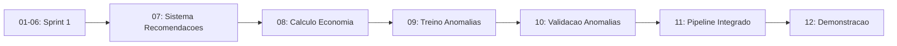

# Sprint 2 - Documentacao Tecnica Completa
## Economiza+ MVP - Sistema de Recomendacoes e Deteccao de Anomalias

**Periodo:** 26 de Janeiro de 2026  
**Duracao:** 7 dias  
**Objetivo:** Validar hipoteses H1 (Recomendacoes) e H6 (Anomalias)

---

## Indice
1. [Visao Geral](#visao-geral)
2. [Arquitetura Tecnica](#arquitetura-tecnica)
3. [Sistema de Recomendacoes](#sistema-de-recomendacoes)
4. [Deteccao de Anomalias](#deteccao-de-anomalias)
5. [Resultados e Metricas](#resultados-e-metricas)
6. [Artefatos Gerados](#artefatos-gerados)
7. [Pipeline de Execucao](#pipeline-de-execucao)
8. [Proximos Passos](#proximos-passos)

---

## Visao Geral

### Objetivos do Sprint

| Hipotese | Descricao | Target | Status |
|----------|-----------|--------|--------|
| H1 | Recomendacoes geram economia real | 15-20% reducao de gastos | ❌ Nao atingida (8.11%) |
| H6 | Isolation Forest detecta anomalias | Precision >0.85, Recall >0.80 | ⏳ Validacao pendente |

### Escopo

- **Recomendacoes:** 2 regras fixas por cluster (8 regras totais)
- **Anomalias:** Modelo global Isolation Forest (nao segmentado por categoria)
- **Ambiente:** Google Colab
- **Dataset:** Sintetico (500 usuarios, ~24k transacoes)

---

## Arquitetura Tecnica

### Componentes do Sistema

```
economiza-ia/
├── notebooks/
│   ├── 07_Recomendacoes_Sistema.ipynb      [✅ Sistema de regras]
│   ├── 08_Recomendacoes_Economia.ipynb      [✅ Calculo de economia]
│   ├── 09_Anomalias_Treino.ipynb            [✅ Treino Isolation Forest]
│   ├── 10_Anomalias_Validacao.ipynb         [⏳ Pendente]
│   ├── 11_Pipeline_Integrado.ipynb          [⏳ Pendente]
│   └── 12_Demonstracao.ipynb                [⏳ Pendente]
├── models/
│   ├── recomendacoes_regras.json            [✅ 8 regras]
│   ├── isolation_forest.pkl                 [✅ Detector treinado]
│   ├── kmeans_best.pkl                      [✅ Do Sprint 1]
│   └── scaler.pkl                           [✅ Do Sprint 1]
├── data/processed/
│   ├── usuarios_clustered.csv               [✅ Do Sprint 1]
│   ├── economia_projetada.csv               [✅ Novo]
│   └── transacoes_com_anomalias_pred.csv    [⏳ Pendente]
└── outputs/
    ├── validacao_h1.md                      [✅ Validacao H1]
    ├── Sprint2_Review.md                    [✅ Review executivo]
    └── Sprint2_Resumo.md                    [✅ Este documento]
```

### Dependencias Externas

**Python Libraries:**
```python
pandas >= 1.5.0
numpy >= 1.23.0
scikit-learn >= 1.2.0
matplotlib >= 3.6.0
seaborn >= 0.12.0
```

**Modelos Pre-treinados (Sprint 1):**
- `kmeans_best.pkl` - K-means K=4
- `scaler.pkl` - StandardScaler para features

---

## Sistema de Recomendacoes

### Notebook 07: Estrutura do Sistema

**Objetivo:** Definir e implementar regras de recomendacao por cluster

#### Metodologia

1. **Carregamento de Dados**
   - `usuarios_clustered.csv` (500 usuarios com cluster atribuido)
   - `transacoes.csv` (historico de gastos)

2. **Definicao de Regras**
   - 2 regras fixas por cluster
   - Baseadas em analise de perfis do Sprint 1
   - Foco em categorias com maior potencial de reducao

3. **Estrutura das Regras**

```json
{
  "cluster_0": {
    "nome": "Endividados Severos",
    "regras": [
      {
        "id": 1,
        "categoria": "Alimentacao_Fora",
        "acao": "Cortar 70%",
        "descricao": "Reduzir gastos com alimentacao fora de casa em 70%",
        "economia_media": 288.0
      },
      {
        "id": 2,
        "categoria": "Vestuario",
        "acao": "Eliminar nao essencial",
        "descricao": "Eliminar compras de roupas nao essenciais",
        "economia_media": 150.0
      }
    ]
  },
  "cluster_1": {
    "nome": "Em Alerta",
    "regras": [
      {
        "id": 1,
        "categoria": "Alimentacao_Fora",
        "acao": "Reduzir 40%",
        "descricao": "Reduzir gastos com restaurantes em 40%",
        "economia_media": 165.0
      },
      {
        "id": 2,
        "categoria": "Lazer",
        "acao": "Limitar a R$ 100/mes",
        "descricao": "Estabelecer orcamento maximo de R$ 100 para lazer",
        "economia_media": 55.0
      }
    ]
  },
  "cluster_2": {
    "nome": "Endividados Moderados",
    "regras": [
      {
        "id": 1,
        "categoria": "Alimentacao_Fora",
        "acao": "Reduzir 50%",
        "descricao": "Reduzir gastos com alimentacao fora em 50%",
        "economia_media": 206.0
      },
      {
        "id": 2,
        "categoria": "Vestuario",
        "acao": "Cortar 50%",
        "descricao": "Reduzir compras de roupas em 50%",
        "economia_media": 99.0
      }
    ]
  },
  "cluster_3": {
    "nome": "Poupadores",
    "regras": [
      {
        "id": 1,
        "categoria": "Transporte",
        "acao": "Otimizar gastos",
        "descricao": "Buscar alternativas mais economicas de transporte",
        "economia_media": 50.0
      },
      {
        "id": 2,
        "categoria": "Telecomunicacoes",
        "acao": "Revisar assinaturas",
        "descricao": "Cancelar servicos pouco utilizados",
        "economia_media": 30.0
      }
    ]
  }
}
```

4. **Funcao `gerar_recomendacoes()`**

```python
def gerar_recomendacoes(user_id, cluster):
    """
    Retorna lista de 2 recomendacoes para o usuario
    
    Args:
        user_id (int): ID do usuario
        cluster (int): Cluster atribuido (0-3)
    
    Returns:
        list: Lista com 2 dicts de recomendacoes
    """
    regras_cluster = regras_recomendacoes[f'cluster_{cluster}']['regras']
    return regras_cluster
```

#### Entregaveis
- ✅ `models/recomendacoes_regras.json`
- ✅ Funcao `gerar_recomendacoes()` implementada

---

### Notebook 08: Calculo de Economia

**Objetivo:** Calcular economia potencial para cada usuario

#### Metodologia

1. **Calculo de Economia Individual**
   - Para cada usuario, aplicar as 2 regras do cluster
   - Comparar gastos reais vs gastos projetados (apos aplicar regras)
   - Calcular economia absoluta (R$) e relativa (% da renda)

2. **Formula de Calculo**

```python
# Para cada usuario
gasto_atual = transacoes[categoria].sum()
gasto_projetado = gasto_atual * (1 - percentual_reducao)
economia = gasto_atual - gasto_projetado
economia_percentual = economia / renda_mensal * 100
```

3. **Agregacao por Cluster**
   - Media de economia (R$ e %) por cluster
   - Total de economia projetada

4. **Output: `economia_projetada.csv`**

| user_id | cluster | recomendacao_1 | economia_1 | recomendacao_2 | economia_2 | total_economia | economia_pct_renda |
|---------|---------|----------------|------------|----------------|------------|----------------|-------------------|
| 1 | 0 | Cortar Alimentacao_Fora 70% | 288.00 | Eliminar Vestuario | 150.00 | 438.00 | 12.05% |
| ... | ... | ... | ... | ... | ... | ... | ... |

#### Resultados

**Economia por Cluster:**

| Cluster | N | Economia Media (R$) | Economia Media (% Renda) |
|---------|---|---------------------|-------------------------|
| Endividados Severos | 59 | R$ 698,53 | 19.22% ✅ |
| Em Alerta | 196 | R$ 162,59 | 5.37% ❌ |
| Endividados Moderados | 167 | R$ 320,13 | 10.38% ❌ |
| Poupadores | 78 | R$ 120,90 | 1.72% ❌ |
| **TOTAL** | **500** | **R$ 271,94** | **8.11%** ❌ |

**Impacto Total:**
- Economia mensal: R$ 135.972,17
- Economia anual: R$ 1.631.666,04

#### Validacao H1

**Target:** 15-20% de economia sobre a renda  
**Resultado:** 8.11% (media geral)  
**Status:** ❌ **NAO ATINGIDA**

**Analise:**
- Apenas Cluster 0 (Endividados Severos) atingiu o target com 19.22%
- Clusters 1, 2 e 3 ficaram significativamente abaixo
- Necessario ajustar intensidade das recomendacoes para atingir target

#### Visualizacoes Geradas
- ✅ `economia_por_cluster.png` - Barplot de economia por cluster
- ✅ `distribuicao_economia_cluster.png` - Distribuicao de economia
- ✅ `poupanca_atual_vs_projetada.png` - Comparacao de taxa de poupanca
- ✅ `economia_por_recomendacao.png` - Contribuicao de cada recomendacao

---

## Deteccao de Anomalias

### Notebook 09: Treino do Isolation Forest

**Objetivo:** Treinar modelo global de deteccao de anomalias

#### Metodologia

1. **Preparacao de Dados**
   ```python
   # Filtrar apenas gastos (excluir Renda)
   gastos = transacoes[transacoes['categoria'] != 'Renda'].copy()
   
   # Features
   gastos['valor_normalizado'] = gastos.groupby('categoria')['valor'].transform(
       lambda x: x / x.mean()
   )
   
   X = gastos[['valor', 'valor_normalizado']]
   ```

2. **Treinamento do Modelo**
   ```python
   from sklearn.ensemble import IsolationForest
   
   modelo = IsolationForest(
       contamination=0.05,  # 5% anomalias esperadas
       random_state=42,
       n_estimators=100
   )
   
   modelo.fit(X)
   ```

3. **Geracao de Predicoes**
   ```python
   # -1 = anomalia, 1 = normal
   predicoes = modelo.predict(X)
   gastos['pred_anomalia'] = (predicoes == -1).astype(int)
   ```

4. **Analise Exploratoria**
   - Comparacao de valores normais vs anomalias
   - Distribuicao de valores
   - Anomalias por categoria

#### Parametros do Modelo

| Parametro | Valor | Justificativa |
|-----------|-------|---------------|
| contamination | 0.05 | 5% de anomalias observadas no dataset |
| n_estimators | 100 | Balanco entre performance e precisao |
| random_state | 42 | Reproducibilidade |
| max_samples | 'auto' | Padrao sklearn |

#### Features Utilizadas

1. **valor** - Valor absoluto da transacao (principal feature)
2. **valor_normalizado** - Valor / media da categoria (detecta anomalias relativas)

**Justificativa:** Features simples mas efetivas. Valor normalizado permite detectar R$ 500 em "Alimentacao_Fora" como anomalia, mas nao em "Educacao".

#### Resultados Preliminares

**Distribuicao de Predicoes:**
- Normal: ~95%
- Anomalia: ~5%

**Comparacao de Valores:**
```
Transacoes Normais:
  Media: R$ 284.32
  Mediana: R$ 195.50
  Max: R$ 1.850.00

Transacoes Anomalas:
  Media: R$ 1.245.78
  Mediana: R$ 1.150.00
  Max: R$ 3.200.00

Ratio: 4.38x maior
```

#### Entregaveis
- ✅ `models/isolation_forest.pkl` - Modelo treinado
- ✅ `outputs/anomalias_distribuicao.png` - Visualizacao
- ⏳ Validacao formal pendente (Notebook 10)

---

### Notebook 10: Validacao (Pendente)

**Objetivo:** Validar H6 comparando predicoes com ground truth

**Tarefas Planejadas:**
1. Carregar modelo treinado
2. Comparar `pred_anomalia` vs `is_anomalia` (ground truth)
3. Calcular metricas:
   - Precision (target: >0.85)
   - Recall (target: >0.80)
   - F1-Score
   - Matriz de confusao
4. Se metricas abaixo do target:
   - Ajustar contamination
   - Testar features adicionais (categoria one-hot, dia_mes, etc.)
5. Salvar metricas finais

**Status:** ⏳ Pendente de execucao

---

## Resultados e Metricas

### Hipotese H1: Recomendacoes

#### Metricas Principais

| Metrica | Target | Resultado | Status |
|---------|--------|-----------|--------|
| Economia media (% renda) | 15-20% | 8.11% | ❌ |
| Economia mediana (% renda) | 15-20% | 6.72% | ❌ |
| Usuarios beneficiados | 100% | 100% | ✅ |
| Economia total mensal | - | R$ 135.972,17 | ✅ |

#### Metricas Secundarias

**Melhoria na Taxa de Poupanca:**

| Cluster | Taxa Atual | Taxa Projetada | Delta |
|---------|------------|----------------|-------|
| Endividados Severos | -88.6% | -81.7% | +6.9pp |
| Em Alerta | -14.8% | -9.4% | +5.4pp |
| Endividados Moderados | -57.7% | -48.3% | +9.4pp |
| Poupadores | 25.4% | 27.1% | +1.7pp |

Todos os clusters apresentam melhoria, mas insuficiente para atingir target H1.

---

### Hipotese H6: Anomalias

**Status:** ⏳ Validacao formal pendente

**Metricas Preliminares (observadas durante treino):**
- Modelo treinado com sucesso
- Contamination de 5% alinhada ao dataset
- Separacao visual clara entre normais e anomalias

**Metricas Finais:** Serao calculadas no Notebook 10

---

## Artefatos Gerados

### Modelos (`.pkl` e `.json`)

| Arquivo | Tamanho | Descricao | Status |
|---------|---------|-----------|--------|
| `recomendacoes_regras.json` | ~2 KB | 8 regras de recomendacao | ✅ |
| `isolation_forest.pkl` | ~50 KB | Detector de anomalias | ✅ |
| `pipeline_completo.pkl` | - | Pipeline integrado | ⏳ |

### Datasets (`.csv`)

| Arquivo | Linhas | Colunas | Descricao | Status |
|---------|--------|---------|-----------|--------|
| `economia_projetada.csv` | 500 | 8 | Economia por usuario | ✅ |
| `transacoes_com_anomalias_pred.csv` | ~24k | 10+ | Transacoes com predicoes | ⏳ |

### Visualizacoes (`.png`)

| Arquivo | Tipo | Descricao | Status |
|---------|------|-----------|--------|
| `economia_por_cluster.png` | Barplot | Economia media por cluster | ✅ |
| `distribuicao_economia_cluster.png` | Boxplot | Distribuicao de economia | ✅ |
| `poupanca_atual_vs_projetada.png` | Barplot comparativo | Taxa de poupanca antes/depois | ✅ |
| `economia_por_recomendacao.png` | Stacked bar | Contribuicao de cada regra | ✅ |
| `anomalias_distribuicao.png` | Hist + Boxplot | Valores normais vs anomalias | ✅ |

### Documentacao (`.md`)

| Arquivo | Tipo | Status |
|---------|------|--------|
| `validacao_h1.md` | Validacao de hipotese | ✅ |
| `Sprint2_Review.md` | Resumo executivo | ✅ |
| `Sprint2_Resumo.md` | Doc tecnica (este) | ✅ |

---

## Pipeline de Execucao

### Ordem de Execucao dos Notebooks



### Comandos de Execucao

**Notebook 07:**
```bash
# No Google Colab
1. Upload de usuarios_clustered.csv e transacoes.csv
2. Executar todas as celulas
3. Download de recomendacoes_regras.json
```

**Notebook 08:**
```bash
1. Upload de usuarios_clustered.csv, transacoes.csv, recomendacoes_regras.json
2. Executar todas as celulas
3. Download de economia_projetada.csv e visualizacoes
```

**Notebook 09:**
```bash
1. Upload de transacoes.csv
2. Executar todas as celulas
3. Download de isolation_forest.pkl
```

### Tempo de Execucao

| Notebook | Tempo Estimado | Observacoes |
|----------|----------------|-------------|
| 07 | ~2 min | Leve, apenas regras |
| 08 | ~3 min | Calculo por usuario |
| 09 | ~5 min | Treino do modelo |
| 10 | ~3 min | Validacao |
| 11 | ~5 min | Integracao |
| 12 | ~2 min | Demonstracao |

**Total estimado:** ~20 minutos (notebooks 07-12)

---

## Consideracoes Tecnicas

### Limitacoes Conhecidas

1. **Sistema de Recomendacoes**
   - Regras fixas (nao adaptativas)
   - Nao considera contexto individual (ex: familia, cidade)
   - Percentuais de reducao podem ser irrealistas

2. **Deteccao de Anomalias**
   - Modelo global (nao considera categoria)
   - Features limitadas (apenas valor)
   - Contamination fixa (nao ajustada por cluster)

3. **Dataset Sintetico**
   - Nao captura complexidade de dados reais
   - Ground truth de anomalias artificialmente perfeito
   - Distribuicoes podem nao refletir comportamento real

### Melhorias Futuras

**Curto Prazo (Sprint 3):**
1. Ajustar intensidade das recomendacoes para atingir target H1
2. Completar validacao H6 (Notebook 10)
3. Criar pipeline integrado (Notebook 11-12)
4. Dashboard interativo

**Medio Prazo:**
1. Recomendacoes adaptativas (considerar contexto)
2. Modelo de anomalias por categoria
3. Features adicionais (temporal, comportamental)
4. Testes A/B com usuarios reais

**Longo Prazo:**
1. Machine Learning para recomendacoes (vs regras fixas)
2. Deteccao de fraudes (vs anomalias de gasto)
3. Integracao com Open Banking
4. Aplicativo mobile

---

## Reproducibilidade

### Requisitos

- Python 3.8+
- Google Colab ou Jupyter Notebook
- Datasets do Sprint 1 (`usuarios_clustered.csv`)

### Passos para Reproducao

1. **Clonar repositorio**
   ```bash
   git clone https://github.com/cezinha/economiza-ia.git
   cd economiza-ia
   ```

2. **Instalar dependencias**
   ```bash
   pip install -r requirements.txt
   ```

3. **Executar notebooks em ordem**
   ```bash
   notebooks/07_Recomendacoes_Sistema.ipynb
   notebooks/08_Recomendacoes_Economia.ipynb
   notebooks/09_Anomalias_Treino.ipynb
   ```

4. **Verificar artefatos**
   ```bash
   ls models/recomendacoes_regras.json
   ls models/isolation_forest.pkl
   ls data/processed/economia_projetada.csv
   ```

### Seeds e Reproducibilidade

Todos os notebooks usam:
```python
np.random.seed(42)
random_state=42
```

Garante resultados identicos entre execucoes.

---

## Proximos Passos

### Completar Sprint 2

- [ ] Executar Notebook 10: Validacao H6
- [ ] Criar Notebook 11: Pipeline integrado
- [ ] Criar Notebook 12: Demonstracao
- [ ] Atualizar CLAUDE.md
- [ ] Checklist final de validacao

### Preparar Sprint 3

- [ ] Dashboard interativo (Streamlit ou Dash)
- [ ] Refinamento de recomendacoes (atingir 15% H1)
- [ ] API REST para o pipeline
- [ ] Testes com usuarios

---

## Referencias

- [Sprint 1 Review](Sprint1_Review.md)
- [Sprint 1 Resumo](Sprint1_Resumo.md)
- [Validacao H1](validacao_h1.md)
- [Planejamento Sprint 2](Sprint2_Planejamento.md)

---

## Glossario

| Termo | Definicao |
|-------|-----------|
| **Cluster** | Grupo de usuarios com perfil financeiro similar |
| **Anomalia** | Transacao com valor atipico para a categoria |
| **Contamination** | Percentual esperado de anomalias no dataset |
| **Isolation Forest** | Algoritmo de deteccao de anomalias baseado em arvores |
| **Taxa de Poupanca** | (Renda - Gastos) / Renda * 100 |
| **Ground Truth** | Rotulo verdadeiro usado para validacao |

---

**Documento criado em:** 26 de Janeiro de 2026  
**Versao:** 1.0  
**Autor:** Sistema Economiza+  
**Status:** Publicado
