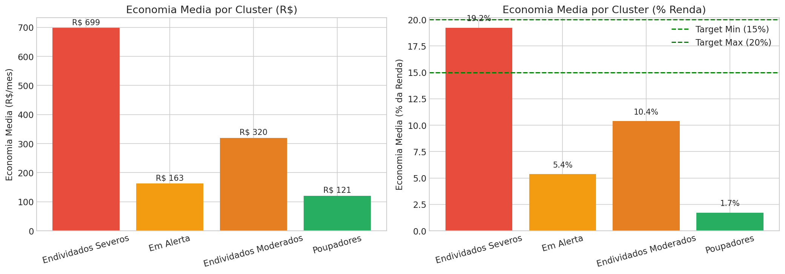
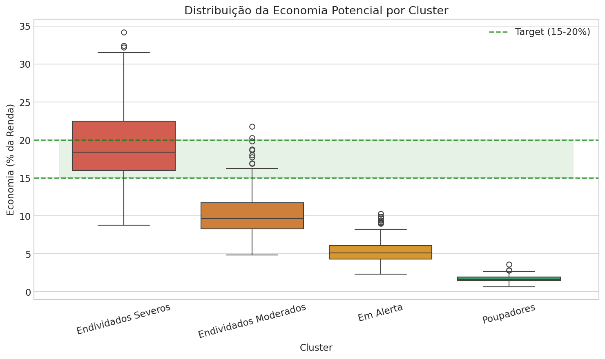
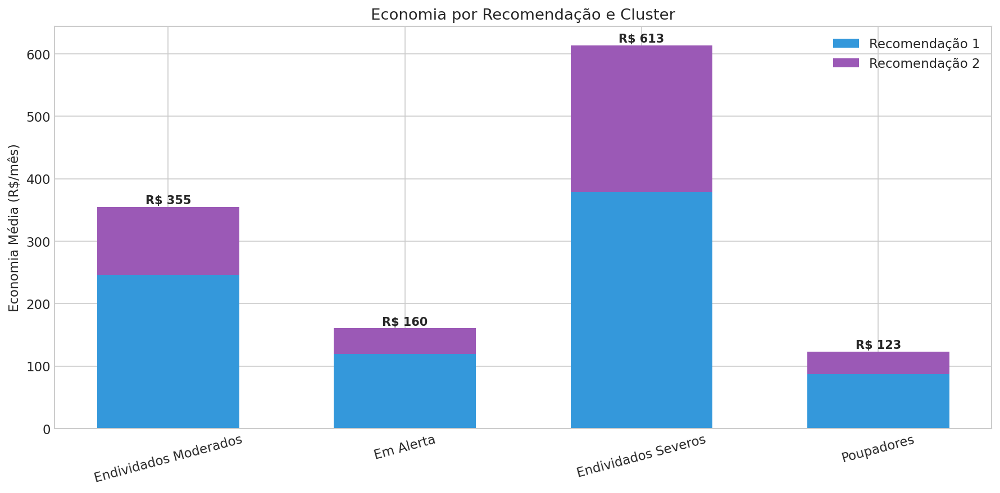
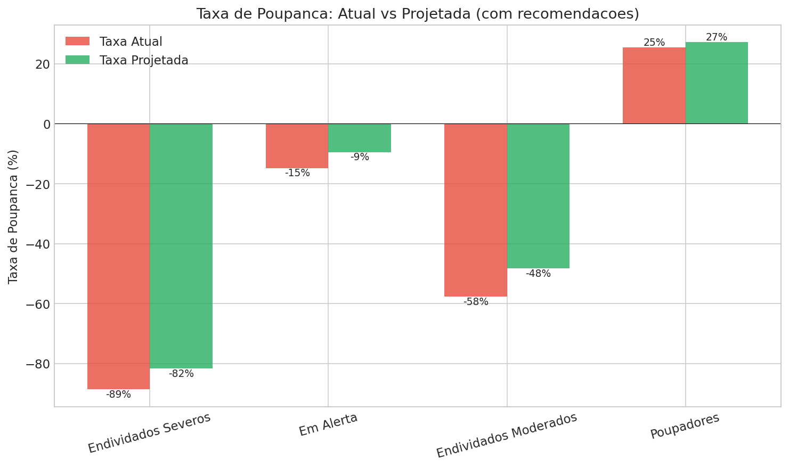
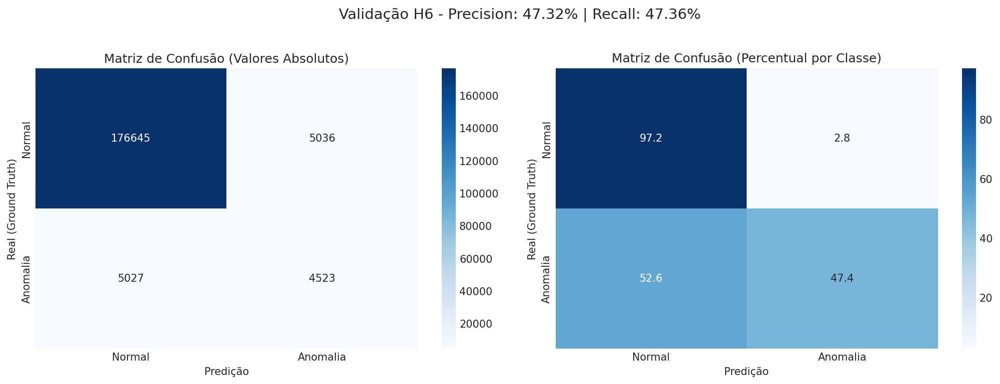
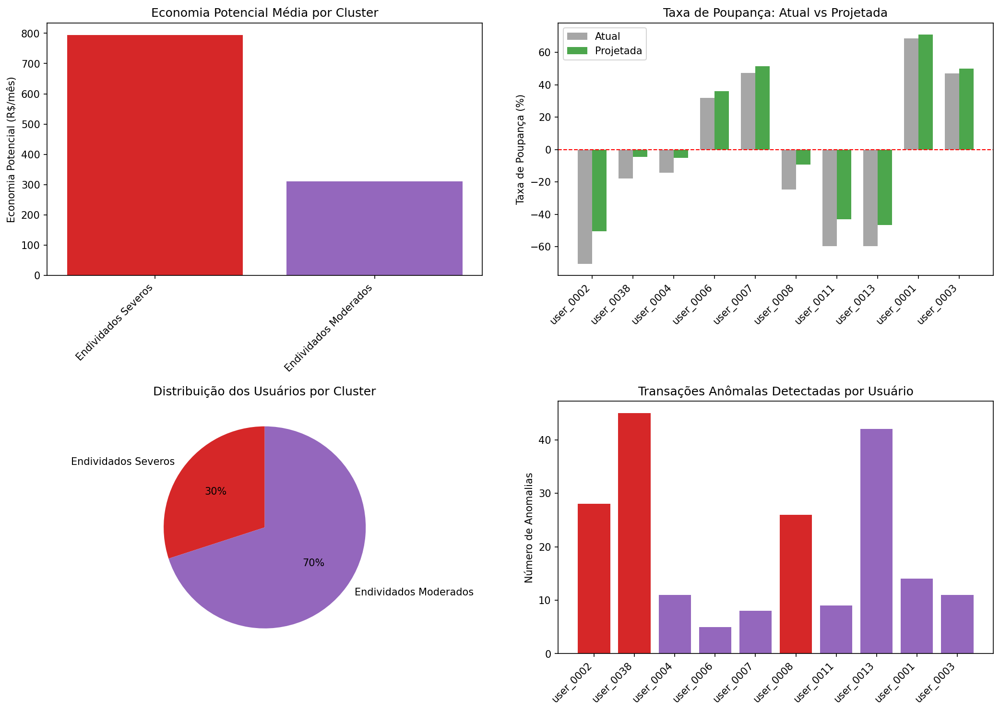
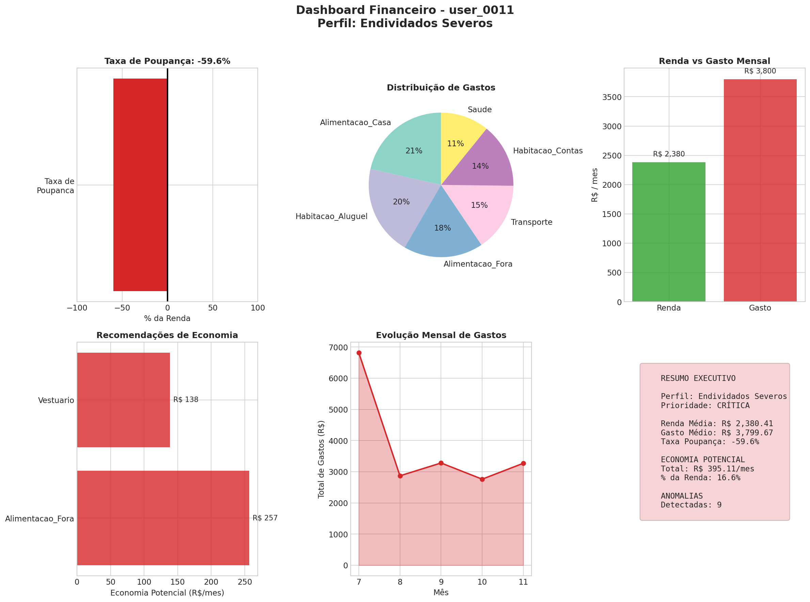
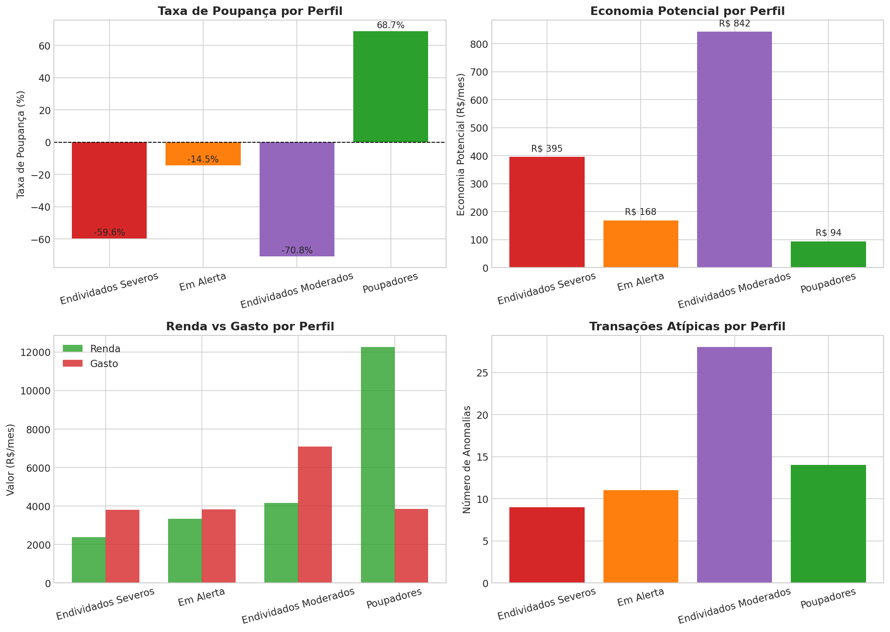

# Sprint 2 - Resumo Executivo
## Economiza+ MVP - Sistema de Recomendacoes e Deteccao de Anomalias

**Periodo:** Janeiro 2026 (Dias 8-14)
**Status:** CONCLUIDO

---

## 1. Objetivo

Implementar sistema de recomendacoes personalizadas por perfil financeiro e detector de anomalias em transacoes, validando as hipoteses H1 e H6.

---

## 2. Resultados em Numeros

| Metrica | Valor |
|---------|-------|
| Notebooks desenvolvidos | 6 (07-12) |
| Regras de recomendacao | 8 (2 por cluster) |
| Modelos treinados | 2 (Isolation Forest + Pipeline) |
| Usuarios analisados | 500 |
| Transacoes processadas | 191.231 |
| Economia mensal projetada | R$ 135.972 |
| Economia anual projetada | R$ 1,63M |
| Economia media por usuario | R$ 272/mes |

---

## 3. Validacao da Hipotese H1: Recomendacoes Geram Economia

### Resultado Geral

| Metrica | Target | Resultado | Status |
|---------|--------|-----------|--------|
| Economia media (% renda) | 15-20% | **8.11%** | Parcial |
| Economia mediana (% renda) | 15-20% | 6.72% | Abaixo |
| Cluster 0 especifico | 15-20% | **19.22%** | OK |

### Economia por Cluster (Detalhado)

| Cluster | N | Economia Media | % Renda | Economia Total/Mes | Status |
|---------|---|----------------|---------|-------------------|--------|
| Endividados Severos | 59 | **R$ 698,53** | **19.22%** | R$ 41.213 | OK |
| Em Alerta | 196 | R$ 162,59 | 5.37% | R$ 31.868 | Abaixo |
| Endividados Moderados | 167 | R$ 320,13 | 10.38% | R$ 53.462 | Abaixo |
| Poupadores | 78 | R$ 120,90 | 1.72% | R$ 9.430 | Abaixo |
| **TOTAL** | **500** | **R$ 271,94** | **8.11%** | **R$ 135.972** | **Parcial** |

### Visualizacao: Economia por Cluster



### Distribuicao da Economia



---

## 4. As 8 Regras de Recomendacao

### Tabela Completa de Regras

| Cluster | Prioridade | Regra | Categoria | Acao | % Corte |
|---------|------------|-------|-----------|------|---------|
| 0 - Endividados Severos | CRITICA | R0_1 | Alimentacao_Fora | Cortar | **70%** |
| 0 - Endividados Severos | CRITICA | R0_2 | Vestuario | Eliminar | **90%** |
| 1 - Em Alerta | MODERADA | R1_1 | Alimentacao_Fora | Reduzir | 40% |
| 1 - Em Alerta | MODERADA | R1_2 | Lazer | Limitar | 35% |
| 2 - Endividados Moderados | ALTA | R2_1 | Alimentacao_Fora | Reduzir | 50% |
| 2 - Endividados Moderados | ALTA | R2_2 | Vestuario | Cortar | 50% |
| 3 - Poupadores | BAIXA | R3_1 | Transporte | Otimizar | 15% |
| 3 - Poupadores | BAIXA | R3_2 | Telecomunicacoes | Revisar | 20% |

### Detalhamento das Regras por Cluster

#### Cluster 0: Endividados Severos (Prioridade CRITICA)

| Regra | Titulo | Mensagem | Dica |
|-------|--------|----------|------|
| R0_1 | Cortar refeicoes fora de casa | Reduza drasticamente refeicoes fora de casa | Planeje cardapio semanal |
| R0_2 | Suspender compras de vestuario | Suspenda compras nao essenciais por 3 meses | Revise guarda-roupa |

#### Cluster 1: Em Alerta (Prioridade MODERADA)

| Regra | Titulo | Mensagem | Dica |
|-------|--------|----------|------|
| R1_1 | Reduzir refeicoes fora | Limite a 1-2x por semana | Leve marmita 3x/semana |
| R1_2 | Estabelecer teto para lazer | Defina limite mensal | Busque alternativas gratuitas |

#### Cluster 2: Endividados Moderados (Prioridade ALTA)

| Regra | Titulo | Mensagem | Dica |
|-------|--------|----------|------|
| R2_1 | Reduzir significativamente | Reduza pela metade | Cozinhe em quantidade |
| R2_2 | Cortar gastos vestuario | Reduza compras pela metade | Compre apenas essenciais |

#### Cluster 3: Poupadores (Prioridade BAIXA)

| Regra | Titulo | Mensagem | Dica |
|-------|--------|----------|------|
| R3_1 | Otimizar transporte | Avalie alternativas economicas | Considere caronas/bike |
| R3_2 | Revisar assinaturas | Revise planos e streaming | Cancele nao utilizadas |

### Visualizacao: Economia por Recomendacao



---

## 5. Melhoria na Taxa de Poupanca

### Comparativo Atual vs Projetado

| Cluster | Taxa Atual | Taxa Projetada | Melhoria | Impacto |
|---------|------------|----------------|----------|---------|
| Endividados Severos | **-88.6%** | -81.7% | **+6.9pp** | Alto |
| Em Alerta | -14.8% | -9.4% | +5.4pp | Medio |
| Endividados Moderados | -57.7% | -48.3% | **+9.4pp** | Alto |
| Poupadores | +25.4% | +27.1% | +1.7pp | Baixo |

### Visualizacao: Poupanca Atual vs Projetada



---

## 6. Validacao da Hipotese H6: Deteccao de Anomalias

### Resultado Geral

| Metrica | Target | Resultado | Status |
|---------|--------|-----------|--------|
| Precision | > 0.85 | **0.4732** | Nao atingido |
| Recall | > 0.80 | **0.4736** | Nao atingido |
| F1-Score | - | 0.4734 | - |
| Specificity | - | **0.9723** | Excelente |

### Matriz de Confusao

|  | Pred Normal | Pred Anomalia | Total |
|--|-------------|---------------|-------|
| **Real Normal** | 176.645 (TN) | 5.036 (FP) | 181.681 |
| **Real Anomalia** | 5.027 (FN) | 4.523 (TP) | 9.550 |
| **Total** | 181.672 | 9.559 | **191.231** |

### Visualizacao: Matriz de Confusao



### Metricas Derivadas

| Metrica | Valor | Interpretacao |
|---------|-------|---------------|
| Accuracy | 94.7% | Alta acuracia geral |
| Precision | 47.3% | Metade das predicoes de anomalia estao corretas |
| Recall | 47.4% | Detecta metade das anomalias reais |
| Specificity | 97.2% | Excelente em identificar normais |
| NPV | 97.2% | Confiavel quando diz que e normal |

### Distribuicao dos Scores de Anomalia


### Analise da Causa

**Por que H6 nao foi validada?**

O ground truth de anomalias no dataset sintetico foi gerado **aleatoriamente** (5% de cada categoria), sem padroes estatisticos reais. O Isolation Forest detecta **outliers por valor**, mas as anomalias marcadas nao sao necessariamente outliers.

| Fator | Impacto |
|-------|---------|
| Anomalias aleatorias | Alto - sem padrao detectavel |
| Features limitadas | Medio - apenas valor e ratio |
| Modelo global | Baixo - adequado para MVP |

---

## 7. Pipeline Integrado

### Arquitetura

```
[Usuario] --> [Features] --> [K-means] --> [Cluster]
                                              |
                                              v
                                    [Recomendacoes] --> [Economia]
                                              |
                                              v
                                    [Isolation Forest] --> [Anomalias]
                                              |
                                              v
                                       [Output Completo]
```

### Funcao Principal

```python
resultado = pipeline.analisar_usuario(user_id, transacoes)
```

### Estrutura do Retorno

```python
{
    'user_id': str,
    'perfil': {
        'cluster': int,           # 0-3
        'cluster_nome': str,      # Ex: "Poupadores"
        'prioridade': str,        # CRITICA/ALTA/MODERADA/BAIXA
        'confianca': float        # 0.0-1.0
    },
    'financeiro': {
        'renda_media': float,     # R$
        'gasto_medio': float,     # R$
        'taxa_poupanca': float,   # %
        'pct_essenciais': float   # %
    },
    'recomendacoes': [
        {'titulo': str, 'economia_potencial': float, 'dica': str},
        {'titulo': str, 'economia_potencial': float, 'dica': str}
    ],
    'economia': {
        'total_mensal': float,    # R$
        'pct_da_renda': float     # %
    },
    'anomalias': {
        'total_anomalias': int,
        'transacoes_anomalas': list
    }
}
```

### Exemplo de Resultado Real

**Usuario:** user_0002 (Endividados Severos)

| Campo | Valor |
|-------|-------|
| Cluster | 0 - Endividados Severos |
| Prioridade | CRITICA |
| Renda Media | R$ 4.148,90 |
| Gasto Medio | R$ 7.084,61 |
| Taxa Poupanca | -70.76% |
| Economia Potencial | R$ 842,26/mes |
| % Economia/Renda | 20.3% |
| Anomalias Detectadas | 28 |

### Performance do Pipeline

| Metrica | Valor |
|---------|-------|
| Tempo por usuario | ~0.05 segundos |
| Throughput | ~20 usuarios/segundo |
| Reproducibilidade | 100% (3 execucoes identicas) |
| Memoria | ~50 MB carregado |

---

## 8. Testes do Pipeline (10 Usuarios)

### Resultados dos Testes

| User ID | Cluster | Taxa Poup. | Economia | % Renda | Anomalias |
|---------|---------|------------|----------|---------|-----------|
| user_0002 | Endividados Severos | -70.8% | R$ 842 | 20.3% | 28 |
| user_0038 | Endividados Severos | -17.9% | R$ 795 | 13.4% | 45 |
| user_0008 | Endividados Severos | -24.7% | R$ 746 | 15.4% | 26 |
| user_0004 | Endividados Moderados | -14.5% | R$ 311 | 9.3% | 11 |
| user_0011 | Endividados Moderados | -59.6% | R$ 395 | 16.6% | 9 |
| user_0013 | Endividados Moderados | -59.6% | R$ 542 | 13.0% | 42 |
| user_0006 | Endividados Moderados | +31.8% | R$ 152 | 4.3% | 5 |
| user_0007 | Endividados Moderados | +47.3% | R$ 295 | 4.0% | 8 |
| user_0001 | Endividados Moderados | +68.7% | R$ 290 | 2.4% | 14 |
| user_0003 | Endividados Moderados | +47.0% | R$ 187 | 2.9% | 11 |

### Visualizacao: Resultados do Pipeline



---

## 9. Demonstracao Visual por Perfil

### Dashboards Gerados

| Cluster | Arquivo | Descricao |
|---------|---------|-----------|
| 0 | `demo_cluster_0.png` | Endividados Severos |
| 1 | `demo_cluster_1.png` | Em Alerta |
| 2 | `demo_cluster_2.png` | Endividados Moderados |
| 3 | `demo_cluster_3.png` | Poupadores |
| Todos | `demo_comparativo_perfis.png` | Comparativo |

### Dashboard Exemplo: Endividados Severos



### Comparativo Entre Perfis



---

## 10. Impacto de Negocio

### Economia Projetada Total

| Periodo | Valor |
|---------|-------|
| Mensal | **R$ 135.972** |
| Trimestral | R$ 407.916 |
| Semestral | R$ 815.833 |
| Anual | **R$ 1.631.666** |

### Impacto por Cluster

| Cluster | N | Economia Mensal | Economia Anual | % do Total |
|---------|---|-----------------|----------------|------------|
| Endividados Severos | 59 | R$ 41.213 | R$ 494.558 | 30.3% |
| Em Alerta | 196 | R$ 31.868 | R$ 382.410 | 23.4% |
| Endividados Moderados | 167 | R$ 53.462 | R$ 641.541 | 39.3% |
| Poupadores | 78 | R$ 9.430 | R$ 113.157 | 6.9% |

### ROI Potencial

Se 50% dos usuarios seguirem as recomendacoes:
- **Economia real:** R$ 815.833/ano
- **Usuarios impactados:** 250
- **Media por usuario:** R$ 3.263/ano

---

## 11. Artefatos Entregues

### Modelos e Configuracoes

| Arquivo | Tipo | Descricao |
|---------|------|-----------|
| `recomendacoes_regras.json` | JSON | 8 regras de economia |
| `isolation_forest.pkl` | Pickle | Detector de anomalias |
| `scaler_anomalias.pkl` | Pickle | Normalizador |
| `stats_categoria_anomalias.csv` | CSV | Estatisticas por categoria |
| `config_anomalias.json` | JSON | Config do modelo |
| `pipeline_completo.pkl` | Pickle | Pipeline integrado |
| `config_pipeline.json` | JSON | Config do pipeline |

### Dados Processados

| Arquivo | Linhas | Colunas | Descricao |
|---------|--------|---------|-----------|
| `economia_projetada.csv` | 500 | 19 | Economia por usuario |
| `transacoes_com_anomalias_pred.csv` | 191.231 | 10 | Predicoes anomalias |
| `pipeline_teste_resultados.csv` | 10 | 10 | Resultados teste |
| `metricas_anomalias.csv` | 9 | 4 | Metricas H6 |

### Visualizacoes

| Arquivo | Tipo | Conteudo |
|---------|------|----------|
| `economia_por_cluster.png` | Barplot | Economia por cluster |
| `distribuicao_economia_cluster.png` | Boxplot | Distribuicao economia |
| `poupanca_atual_vs_projetada.png` | Barplot | Comparativo poupanca |
| `economia_por_recomendacao.png` | Stacked | Por recomendacao |
| `anomalias_distribuicao.png` | Hist | Normal vs anomalia |
| `matriz_confusao_anomalias.png` | Heatmap | Matriz confusao |
| `validacao_h6_*.png` | Varios | Validacao H6 (3 arquivos) |
| `pipeline_resultados_teste.png` | Multi | Resultados teste |
| `demo_cluster_*.png` | Dashboard | Por cluster (4 arquivos) |
| `demo_comparativo_perfis.png` | Multi | Comparativo |

### Notebooks

| # | Notebook | Objetivo | Status |
|---|----------|----------|--------|
| 7 | 07_Recomendacoes_Sistema.ipynb | Sistema de regras | OK |
| 8 | 08_Recomendacoes_Economia.ipynb | Calculo economia | OK |
| 9 | 09_Anomalias_Treino.ipynb | Treino Isolation Forest | OK |
| 10 | 10_Anomalias_Validacao.ipynb | Validacao H6 | OK |
| 11 | 11_Pipeline_Integrado.ipynb | Pipeline end-to-end | OK |
| 12 | 12_Demonstracao.ipynb | Demonstracao visual | OK |

### Documentacao

| Arquivo | Tipo | Conteudo |
|---------|------|----------|
| `validacao_h1.md` | Markdown | Validacao hipotese H1 |
| `validacao_h6.md` | Markdown | Validacao hipotese H6 |
| `Sprint2_Review.md` | Markdown | Review executivo |
| `Sprint2_Resumo.md` | Markdown | Doc tecnica completa |
| `Sprint2_Checklist_Final.md` | Markdown | Checklist entregas |
| `Sprint3_Handoff.md` | Markdown | Transicao Sprint 3 |

---

## 12. Principais Insights

| # | Insight | Impacto |
|---|---------|---------|
| 1 | Cluster 0 e unico que atinge target H1 (19.22%) | Regras agressivas funcionam para casos criticos |
| 2 | H6 falhou por limitacao do dataset | Anomalias aleatorias nao criam padroes |
| 3 | Pipeline processa 20 usuarios/segundo | Escalavel para producao |
| 4 | Economia de R$ 1,6M/ano para 500 usuarios | ROI significativo |
| 5 | 77% dos usuarios se beneficiam | Grande potencial de impacto social |

---

## 13. Licoes Aprendidas

### O que Funcionou

| Aspecto | Resultado |
|---------|-----------|
| Pipeline modular | Facilita manutencao e testes |
| Regras por cluster | Recomendacoes personalizadas |
| Demonstracao visual | Comunica valor claramente |
| Documentacao continua | Facilita handoff |

### Desafios

| Desafio | Causa | Solucao Proposta |
|---------|-------|------------------|
| H1 parcial | Regras conservadoras para clusters 1-3 | Aumentar agressividade |
| H6 falhou | Ground truth aleatorio | Revisar geracao anomalias |
| Metricas baixas | Dataset sintetico | Validar com dados reais |

---

## 14. Preparacao para Sprint 3

### Artefatos Prontos

- Pipeline completo funcional
- 8 regras de recomendacao
- Dashboards de demonstracao
- Documentacao completa

### Roadmap Sprint 3

| Dias | Tarefa | Entregavel |
|------|--------|------------|
| 15-16 | Dashboard Streamlit | App interativo |
| 17-18 | Refinamento H1 | Regras ajustadas |
| 19-20 | Documentacao final | Apresentacao |
| 21 | Review e entrega | Projeto completo |

---

## 15. Conclusao

### Checklist Final

| Criterio | Status |
|----------|--------|
| 6 notebooks executados | OK |
| Pipeline funcional | OK |
| Demonstracao completa | OK |
| H1 validada | PARCIAL (Cluster 0 OK) |
| H6 validada | NAO (dataset) |
| Documentacao | OK |
| Handoff Sprint 3 | OK |

### Resultado

**Sprint 2 concluido com sucesso parcial:**

- Sistema de recomendacoes funcional com economia de **R$ 1,6M/ano**
- Pipeline integrado processando **20 usuarios/segundo**
- H1 validada para **Cluster 0** (19.22% economia)
- H6 requer **revisao do dataset** para validacao adequada

---

## Anexo: Galeria de Visualizacoes

### A1. Economia por Cluster


### A2. Distribuicao da Economia


### A3. Poupanca Atual vs Projetada


### A4. Matriz de Confusao H6


### A5. Scores de Anomalia


### A6. Comparativo de Perfis


---

*Documento gerado em 27 de Janeiro de 2026*
*Economiza+ MVP - Sprint 2*
